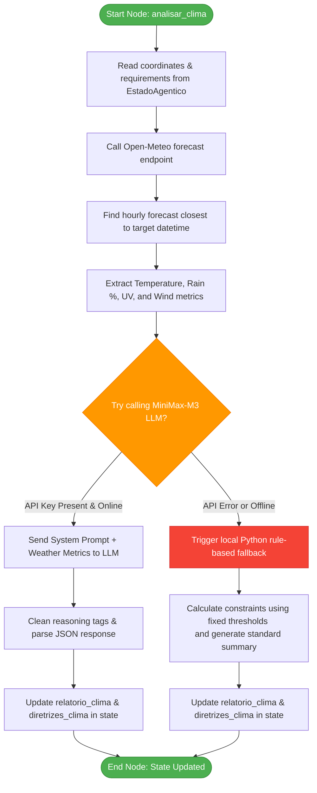

# Agent 2: Weather Analyst Agent

The **Weather Analyst Agent** is a core node in the MOVA-SE agentic routing pipeline. It is responsible for retrieving and analyzing meteorological forecasts for the requested activity time and location, converting raw environmental metrics into user-friendly safety reports and quantitative routing guidelines.

---

## What It Does
1. **Weather Querying:** Calls the public, free **Open-Meteo API** to fetch forecast data (temperature, wind speed, precipitation probability, and UV index) matching the target location and starting time.
2. **Cognitive Interpretation:** Utilizes the **MiniMax-M3 LLM** (via LangChain's OpenAI-compatible interface) to analyze weather safety risks for the specific activity modality.
3. **Structured Translation:** Translates raw JSON values into:
   - A friendly text narrative for the end-user.
   - Boolean routing constraints used by the graph routing engine to adjust edge weights (e.g., favoring tree shade on high-UV days or avoiding dirt roads when rain is likely).
4. **Resilient Fallback:** Includes a local, rule-based heuristic fallback that automatically calculates the metrics and generates the output if the LLM is unreachable or if no API key is configured.

---

## Data Contract

### 1. Inputs (State Requirements)
The agent consumes the following keys from the shared `EstadoAgentico` (LangGraph state):

* **`coordenadas`** (`tuple[float, float]`): The resolved latitude and longitude of the starting point.
* **`requisitos`** (`dict`): The consolidated requirements dictionary containing:
  * `janela_temporal` (`str`): ISO 8601 target datetime string (e.g., `"2026-07-19T07:00"`).
  * `modalidade` (`str`): Activity modality (e.g., `"Corrida de Rua Pedestre"` or `"Ciclismo Urbano"`).

### 2. Outputs (State Updates)
The agent updates the shared state with the following keys:

* **`relatorio_clima`** (`str`): A descriptive weather summary and health recommendation text for the user.
* **`diretrizes_clima`** (`dict`): A structured dictionary containing boolean routing flags:
  ```json
  {
    "requer_sombra": true,         # Triggered if UV Index > 4 or Temp > 26°C
    "risco_chuva": false,          # Triggered if precipitation probability > 40%
    "vento_forte": false,          # Triggered if wind speed > 20 km/h
    "temperatura_extrema": false   # Triggered if Temp > 32°C or < 10°C
  }
  ```

---

## Agent Workflow


