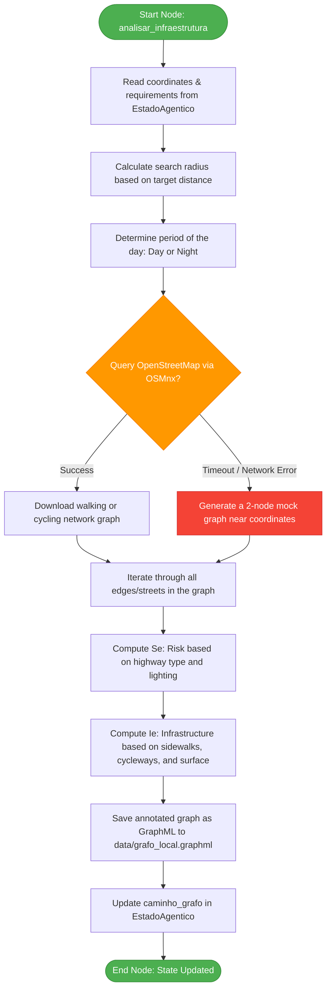

# Agent 3: Infrastructure and Safety Agent

The **Infrastructure and Safety Agent** is responsible for retrieving and assessing the physical quality, pedestrian/cycling amenities, and security of the roads surrounding the user's starting point.

---

## What It Does
1. **Network Downloading:** Downloads the local street network from OpenStreetMap (using the **OSMnx** library) centered at the starting coordinates.
   - For **Running** (`Corrida de Rua Pedestre`), it downloads the walkable network (`walk`).
   - For **Cycling** (`Ciclismo Urbano`), it downloads the cyclable network (`bike`).
   - The search radius is dynamically scaled based on the target distance.
2. **Edge Classification:** Evaluates each street segment (edge) in the graph and calculates two custom metrics:
   - **$S_e$ (Urban Risk Factor):** High-speed arterial roads or unlit streets at night (based on the `lit` tag) are penalized (higher values up to `1.0`).
   - **$I_e$ (Infrastructure Bonus):** Streets with sidewalks, designated pedestrian paths, cycleways, or high-quality paving (asphalt/concrete) are bonified (higher values up to `1.0`).
3. **Graph Serialization:** Saves the fully annotated NetworkX graph to a `.graphml` file in the project's `data/` directory.
4. **Resilient Fallback:** If OSMnx/Overpass is offline or throttled, it generates a mock, 2-node graph near the starting point so that the execution pipeline does not break.

---

## Data Contract

### 1. Inputs (State Requirements)
The agent consumes the following keys from the shared `EstadoAgentico` (LangGraph state):

* **`coordenadas`** (`tuple[float, float]`): Resolved latitude and longitude of the starting point.
* **`requisitos`** (`dict`): The consolidated requirements dictionary:
  * `distancia_alvo_km` (`float`): The user's target activity distance in kilometers.
  * `janela_temporal` (`str`): ISO 8601 target datetime string.
  * `modalidade` (`str`): Target activity modality.

### 2. Outputs (State Updates)
The agent updates the shared state with:

* **`caminho_grafo`** (`str`): The absolute path to the saved GraphML file (`data/grafo_local.graphml`) containing the annotated network graph.

---

## Agent Workflow

